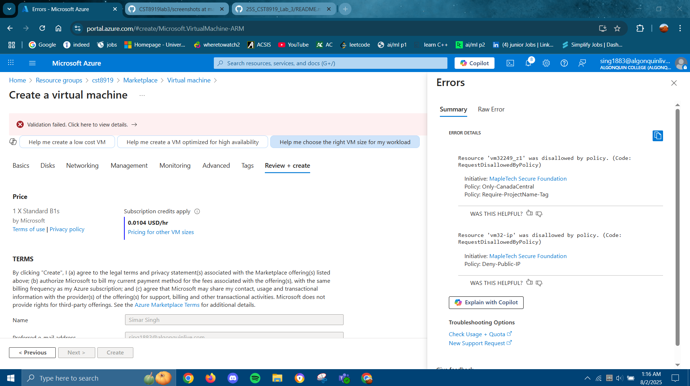
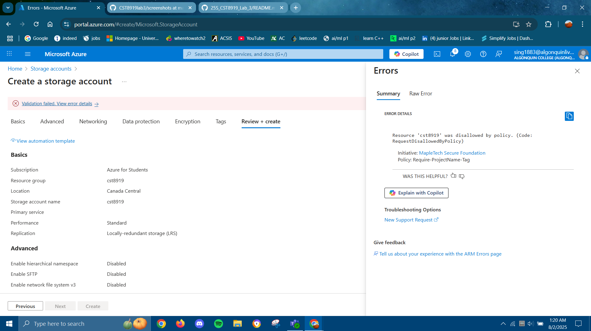
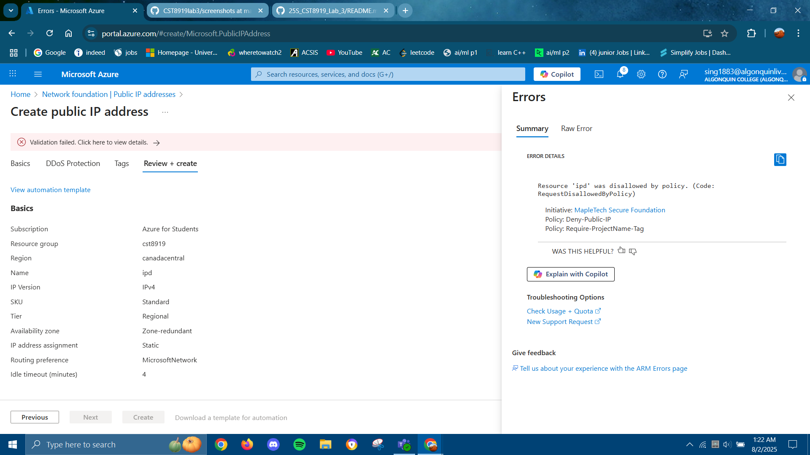
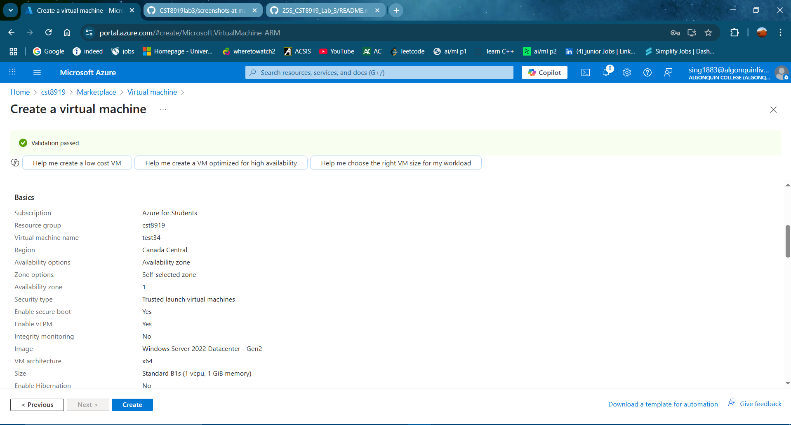
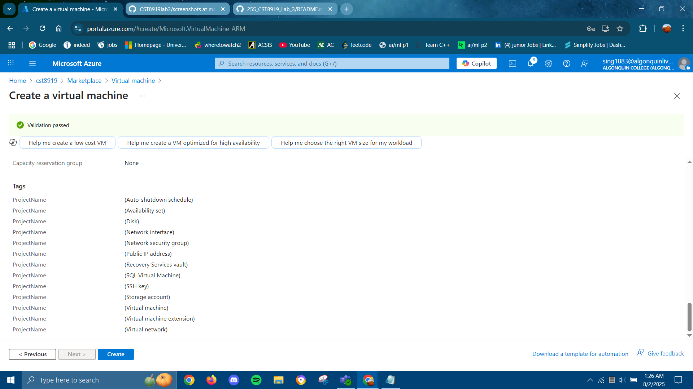

# CST8919lab3

## Youtube Link: https://youtu.be/QjZ5MXxdTTU

## Summary

This lab demonstrates how to implement cloud governance and compliance using **Azure Policy**. As a Cloud Security Engineer at MapleTech Solutions, the goal was to prevent unregulated resource deployments by enforcing security and operational guardrails through custom policy definitions and a policy initiative.

**Key Objectives:**
- Restrict resource deployment to the *Canada Central* region.
- Enforce mandatory tagging with `ProjectName`.
- Block creation of any public IP addresses.
- Group policies into a Policy Initiative and apply it at the resource group level.

---

## Policies Implemented

### 1. **Region Lockdown – `Only-CanadaCentral`**
- **Type:** Custom Policy
- **Effect:** Deny
- **Purpose:** Ensures all Azure resources are deployed only in `canadacentral`. Prevents data sovereignty risks and maintains geographic consistency.

### 2. **Mandatory Tagging – `Require-ProjectName-Tag`**
- **Type:** Custom Policy
- **Effect:** Deny
- **Purpose:** Enforces the presence of a `ProjectName` tag on all resources to improve cost tracking, resource organization, and governance.

### 3. **Block Public IP – `Deny-Public-IP`**
- **Type:** Custom Policy
- **Effect:** Deny
- **Purpose:** Prevents the creation of public IP addresses, reducing the attack surface and minimizing exposure of cloud resources to the internet.

## 💡 Challenges & Lessons Learned

### 🔄 Challenges
- Understanding how Azure Policy syntax works (especially with custom JSON logic).
- Remembering to assign the **initiative**, not just create it.

### ✅ Lessons Learned
- Azure Policy is a **powerful preventive control** — ideal for enforcing security, compliance, and operational standards.
- Custom policies offer **fine-grained control** but require careful testing.
- Grouping policies into initiatives makes management **scalable and consistent**.
- Enforcement mode must be set to **deny** to block non-compliant actions — audit mode only logs them.

| Action | Expected Outcome |
|--------|------------------|
| Deploy VM in **East US** |  |
| Deploy Storage Account **without `ProjectName` tag** | |
| Create a **Public IP** | |
| Deploy VM in **Canada Central** with tag |   |
